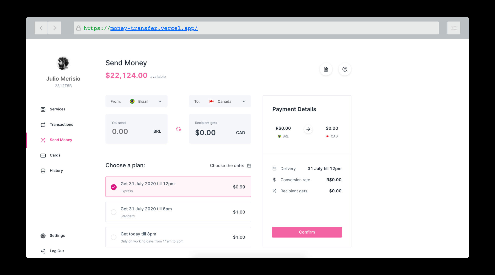

<h1 align="center">
  
</h1>

<h1 align="center">
  Money Transfer App
</h1>
<p align="center">Challenge</p>

<p align="center">
  <a href="#technology">Technology</a> •
  <a href="https://money-transfer.vercel.app/">Link to Preview</a>
</p>

### Getting Started

```bash
# First, clone this repository:
$ git clone https://github.com/mateusdotcc/money-transfer.git

# Access the project folder in the / cmd terminal:
$ cd money-transfer

# Install the dependencies:
$ yarn or npm i

# Run the application in development mode:
yarn start or npm run start

# The server will start at port: 3000 go to:
http://localhost:3000
```

### Technology

---

- [Node.js](https://nodejs.org/en/)
- [React](https://pt-br.reactjs.org/)
- [Redux](https://redux.js.org/)
- [Redux Saga](https://redux-saga.js.org/)
- [React Helmet](https://github.com/nfl/react-helmet)
- [Reacti18Next](https://react.i18next.com/)
- [React Icons](https://react-icons.github.io/react-icons/)
- [React Spinner Kit](https://www.npmjs.com/package/react-spinners-kit)
- [React Smooth Scrollbar](https://www.npmjs.com/package/react-smooth-scrollbar)
- [CurrencyJS](https://currency.js.org/)
- [Cashify](https://www.npmjs.com/package/cashify)
- [Antd](https://ant.design/)
- [Styled Normalize](https://github.com/sergeysova/styled-normalize)
- [TypeScript](https://www.typescriptlang.org/)
- [Axios](https://github.com/axios/axios)
- [Polished](https://polished.js.org/)
- [Styled Components](https://styled-components.com/)
